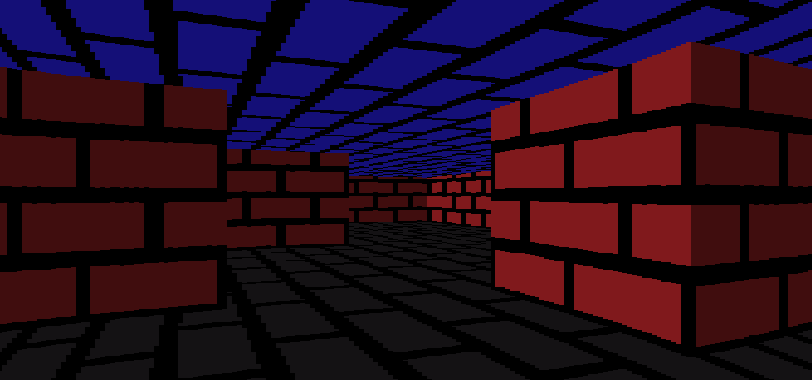

# Raycaster

This game uses the raycasting method to create a 3d perspective from a 2d map which is generated from a simple array in the code. For the rendering, OpenGL is used and is very easy to compile running gcc with proper includes.

To move around, W and S move the player forwards and backwards respectively, and A and D turn the camera around left and right respectively. 

